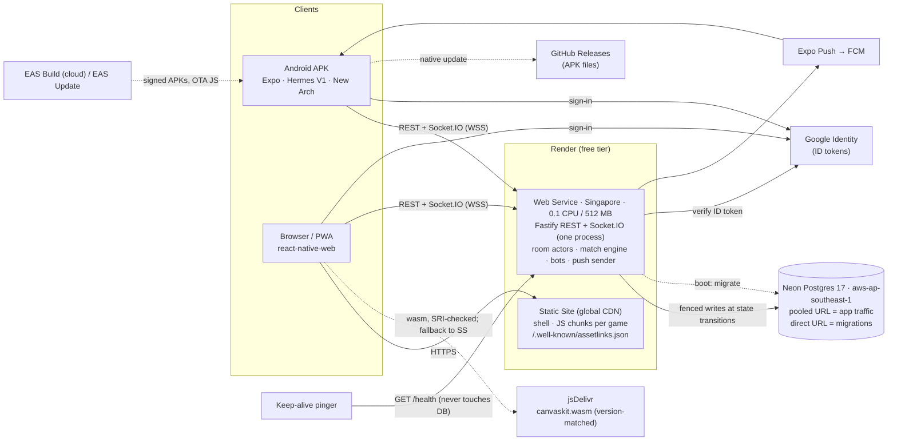
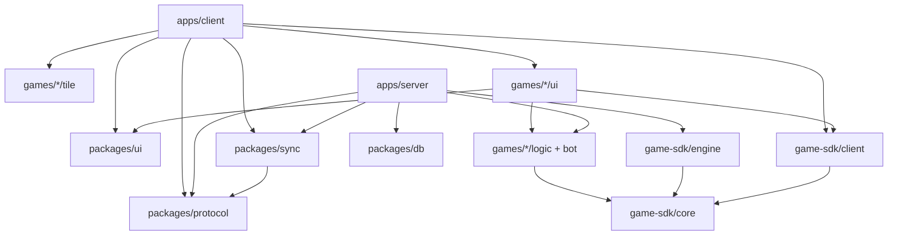
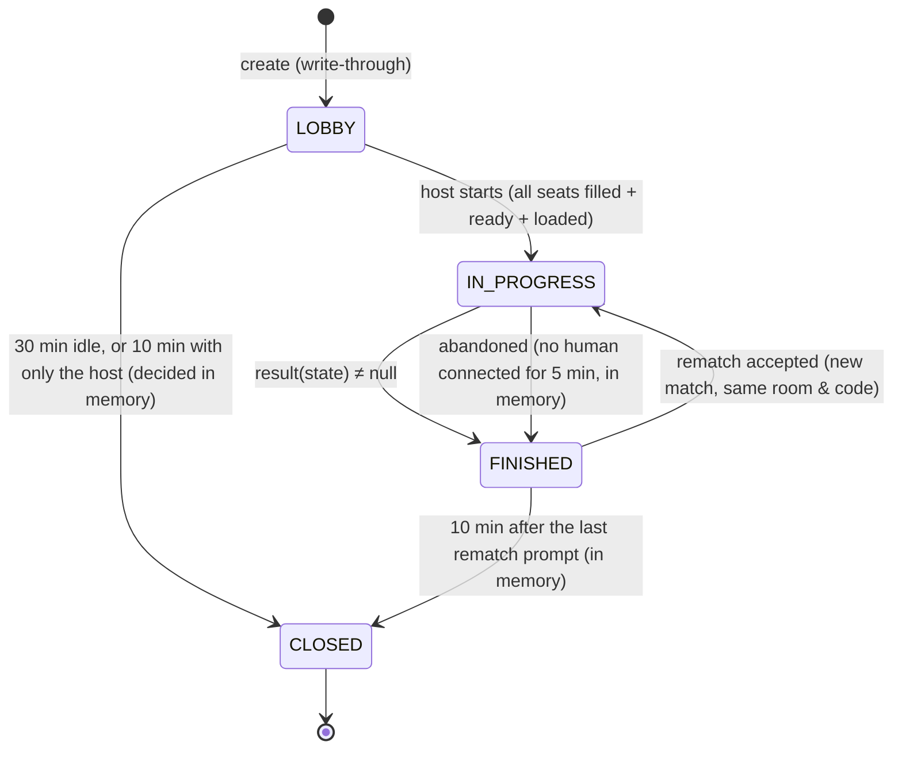

# {{APP_NAME}}: Architecture

| | |
|---|---|
| **Status** | Draft v0.3, for Phase 0 approval. v0.2 added facts verified on 2026-10-01 against live docs and the npm registry. v0.3 applies an adversarial review (95 findings). |
| **Date** | 2026-10-05 |
| **Scope** | Defined by [`BUILD_BRIEF.md`](BUILD_BRIEF.md) |
| **Unresolved choices** | Tracked in [`OPEN_QUESTIONS.md`](OPEN_QUESTIONS.md) |
| **Decisions** | Logged in [§14](#14-decision-log). **Brief** = locked by the brief. **Proposed** = needs your OK. |

Sections:

1. [System shape](#1-system-shape)
2. [Repository & boundaries](#2-repository--boundaries)
3. [Game SDK](#3-game-sdk)
4. [Real-time multiplayer](#4-real-time-multiplayer)
5. [Server process](#5-server-process)
6. [Client app](#6-client-app)
7. [Identity & auth](#7-identity--auth)
8. [Offline-first sync](#8-offline-first-sync)
9. [Data model](#9-data-model)
10. [Hosting & delivery](#10-hosting--delivery)
11. [Android build & distribution](#11-android-build--distribution)
12. [Testing & CI](#12-testing--ci)
13. [Version matrix](#13-version-matrix)
14. [Decision log](#14-decision-log)

---

## 1. System shape



**Properties that shape everything below:**

- **One authority.** A single Node process owns every live room in memory, and Postgres is a durable *journal* of transitions. Render's deploys briefly run two processes (§5.6), so every write is **fenced**.
- **Neon must be able to sleep.** The real budget is **wake-ups**, not queries. Each isolated wake keeps the compute up for at least 5 min, which at 0.25 CU is ≈ 0.021 CU-h, so 100 CU-h ≈ 4,800 isolated wakes a month. Hence the §5.3 rules:
  - timers never write;
  - idle clients cost zero queries;
  - guest rows are deferred;
  - a governor protects the monthly budget.
- **The client is a full game runtime.** Solo games and vs-bot matches run the same pure logic packages and the same match engine in process (§3.3, §6.3). The server is required only for multiplayer, accounts and sync.
- **Two deployables plus one database.** Upgrading to Render Starter changes only `plan:` (§10.4).
- **Hard monthly quotas the brief doesn't list (§10.5):**
  - Render Hobby: **5 GB of outbound bandwidth** and **500 build-pipeline minutes**;
  - Neon free: **100 CU-h** and **5 GB of egress**.

  So the APK is never served from Render, and CanvasKit comes from a CDN.

## 2. Repository & boundaries

```
/
├─ apps/
│  ├─ client/                 Expo app → Android APK + web export
│  └─ server/                 Fastify + Socket.IO + REST, bundled with esbuild (migrations shipped in dist/)
├─ packages/
│  ├─ config/                 tsconfig bases, ESLint flat config, dependency-cruiser rules, vitest preset
│  ├─ game-sdk/               core/ (contract, Rng, Secret<T>, SoloGameModule) · engine/ (MatchEngine) · testing/ (harness) · client/ (registry, React-only)
│  ├─ protocol/               zod schemas for every socket event + REST DTO; PROTOCOL_VERSION
│  ├─ db/                     Drizzle schema, migrations, seed (catalog; quiz importer)
│  ├─ sync/                   outbox, HLC, merge rules (pure; storage adapters injected)
│  ├─ ui/                     design tokens, themed RN components, motion curves, particle/shader primitives
│  └─ games/<id>/             src/logic · src/bot (pure) · src/tile (no Skia on web) · src/ui (Skia/RN) · assets/ · manifest.ts
│        dev-tictactoe · dev-secret-pick (dev-only) · cricket · ludo · carrom · quiz
│        runner · lantern-quest · kolam · koi-pond · color-sort · zen-garden
├─ spikes/                    throwaway Phase 0 spike code (archived after the spike report)
├─ scripts/isolated.sh        runs every tool without this machine's global configs or tokens (CLAUDE.md)
├─ docs/  render.yaml  .github/workflows/{ci,keep-alive}.yml
```



**Rules,** enforced by dependency-cruiser in CI and by ESLint `no-restricted-imports` in the editor:

- **Pure packages:** `games/*/logic`, `games/*/bot`, `game-sdk/core|engine`, `protocol` and `sync` must not import `react*`, `expo*`, Skia, DOM globals or `node:*`. They also must not call `Math.random`, `Date.now` or `new Date()`. Time and randomness come in through `ctx`.
- **Server:** `apps/server` must never import `games/*/ui`, `games/*/tile` or `game-sdk/client`.
- **Home bundle:** the Home entry chunk must never reach a `games/*/ui` module. A CI bundle check enforces this.
- **Internal packages:** workspace packages are consumed as TS source (`exports` point at `src/`), with no per-package build step. Per-package `tsc --noEmit` provides type safety.
- **Tool isolation:** every git, pnpm, npx, expo, gradle, turbo and brew command runs through `scripts/isolated.sh`. Turborepo's remote cache is disabled.

## 3. Game SDK

### 3.1 Contract

The brief's §5 interface, plus additive refinements marked `NEW`. The rationale is in §3.2, and approval is tracked as OPEN_QUESTIONS I6.

```ts
export type Seat = number;
export type Viewer = { kind: 'seat'; seat: Seat } | { kind: 'spectator' } | { kind: 'replay' }; // NEW: replay
export type BotLevel = 'easy' | 'medium' | 'hard';
export type Ctx = { rng: Rng; now: number };      // NEW meaning: now = GAME time in ms (§3.3), not wall time

export interface SeatInfo {
  seat: Seat;
  team: number | null;
  occupant: { kind: 'human'; userId: string } | { kind: 'bot'; level: BotLevel };
}

export interface ModeManifest { /* unchanged from brief */ pauseOnDisconnect?: boolean }  // NEW (Phase 1, OQ D30)
export interface GameManifest { /* unchanged from brief */ logicVersion: number }        // NEW

export interface Awaiting { seats: Seat[]; deadlineAt: number | null }                    // NEW (game time)
export type Effect = { kind: 'simulate'; id: string; input: unknown };                     // NEW
export interface Step<S, E> { state: S; events: E[]; effects?: Effect[] }                  // NEW: effects
export type Rejection = { ok: false; reason: 'NOT_YOUR_TURN' | 'ILLEGAL' | 'STALE' | 'FINISHED' | (string & {}) }; // closed per game

export interface GameModule<S, A, C, V, E extends GameEvent = GameEvent> {
  manifest: GameManifest;
  stateVersion: number;                                                    // NEW
  configSchema: ZodType<C>;
  actionSchema: ZodType<A>;
  init(ctx: { config: C; mode: string; seats: SeatInfo[]; rng: Rng; now: number }): S;
  awaiting(state: S): Awaiting;                                            // NEW
  wakeAt?(state: S): number | null;                                        // NEW
  tick?(state: S, ctx: Ctx): Step<S, E>;
  legalActions?(state: S, seat: Seat): A[];
  sampleAction?(state: S, seat: Seat, rng: Rng): A;                        // NEW
  validate(state: S, action: A, seat: Seat): { ok: true } | Rejection;    // closed reason enum
  reduce(state: S, action: A, seat: Seat, ctx: Ctx): Step<S, E>;
  resolve?(state: S, effectId: string, output: unknown, ctx: Ctx): Step<S, E>; // NEW
  onTimeout(state: S, seat: Seat, rng: Rng): A;
  result(state: S): MatchResult | null;
  viewFor(state: S, viewer: Viewer): V;                                    // typed, was `unknown`
  eventFor(event: E, viewer: Viewer): E | null;                            // NEW
  invariants?(state: S): string[];                                         // NEW
  bot: { choose(view: V, seat: Seat, level: BotLevel, rng: Rng): A | Promise<A> }; // async allowed
  migrateState?(snapshot: unknown, fromStateVersion: number): S;           // NEW
}
```

### 3.2 Why each refinement

| Change | Why |
|---|---|
| `awaiting(state)` | Lets the room engine handle generically: turn timers, `onTimeout`, the bot scheduler, the "your turn" UI, AFK counting and push. Simultaneous moves (Hand Cricket picks, quiz answers) are simply `seats: [0, 1]`. |
| `wakeAt` + `tick` | Time-driven phase changes (reveal pauses, a question closing) become pure functions of state, so there's one timer per room. |
| `effects` + `resolve` | Carrom physics shouldn't block the event loop or sit inside a synchronous reducer. The reducer *requests* a `simulate` effect, and the engine runs it and feeds the output back. The output is **logged**, so replays never re-simulate, which avoids the Hermes-vs-V8 float problem for replays. |
| `eventFor` | Brief rule 3 ("every broadcast passes through `viewFor`") must also cover events, because `picked {seat, value}` leaks just as a state field would. |
| Typed `V` + closed `Rejection` reasons | Casts and free-text reasons are where redaction bugs hide. Bots consume `V`, so they can't see hidden information either. |
| Game clock (`ctx.now`) | Restores and pauses must move deadlines without editing `S`. The engine shifts game time instead (§3.3). |
| `stateVersion` + `migrateState`, `logicVersion` | A deploy can land mid-match. Snapshots either migrate, or the match closes as "abandoned (server update)"; nothing crashes. Replays require a matching `logicVersion`. |
| `sampleAction` | Carrom's action space is continuous, so property tests sample it. |
| Async `bot.choose` | The Carrom bot may run up to 3 simulations (§7.3). Late results are dropped as stale (§3.3). |
| `pauseOnDisconnect` | Without it, the brief's own Phase 1 acceptance test ("reopen within 60 s, back on the same ball") can't pass with 5 s picks (OQ D30). |
| `invariants` | Property tests can check game-specific invariants without the harness knowing the rules. |

### 3.3 MatchEngine (`game-sdk/engine`): the same code on server and client

The engine wraps a `GameModule`. It's pure TS with an injected `Scheduler`, `EffectRunner` and clock, so it runs on Node, Hermes, V8 and Vitest.

- **Versions strictly increase across processes:** `version = epoch × 2³² + n`, where `epoch` is per server process (§5.5). Clients always accept the snapshot in a `room:join` ack, and show a "Resynced" toast if `lastStateVersion` was ahead.
- **Game clock.** Modules only see game time: `gameNow = max(lastNow, serverNow − clockOffset)`.
  - When no human seat is connected, the engine **freezes** the clock: no timeouts, ticks or bot moves.
  - On restore it sets `clockOffset` so that every pending deadline has at least 15 s left, without editing `S`.
  - Every offset change is logged as `{kind:'clock', clockOffset}`, so replays stay deterministic.
  - Views convert deadlines to wall time, and client-claimed times (Arcade taps) are converted back to game time.
- **Staleness:**
  - `awaitedSince[seat]` records the version at which the seat's current decision began.
  - `game:action` carries `baseVersion`. The engine dedupes by `clientActionId` first, then rejects `STALE` if `baseVersion < awaitedSince[seat]`. So a retried Hand Cricket pick can never land on the next ball.
  - Bot moves, timeouts and async bot results are tagged `(version, seat, occupantEpoch)` and dropped if stale.
- **Idempotency survives restarts.** `client_action_id` is stored per action, with `UNIQUE(match_id, seat, client_action_id)`. The in-memory LRU is rebuilt during tail replay, so a retry after a restart gets the original ack.
- **Action log:**

  ```
  {seq, kind: action|timeout|tick|effect|clock, seat?, payload, now, clientActionId?}
  ```

- **Engine also does:** per-viewer outputs (`viewFor`, `eventFor`), one timer per room (`min(awaiting.deadlineAt, wakeAt)`), AFK counting, and bot driving (a seeded 400–1600 ms thinking delay from the bot stream).
- **EngineSnapshot:**

  ```
  {S, rng: {game, bot}, version, awaitedSince, afkCounters, seatControl,
   pendingEffects, clockOffset, lastSeq}
  ```

  The harness round-trips it through the exact jsonb encoding. `Map`, `Set`, `undefined` and `bigint` are banned in `S`.
- **Replay mode** (used for restore *and* match replays):
  - it runs no effects, timers or bots, and applies only the logged entries;
  - afterwards, restore re-issues any `pendingEffects` that have no logged result, so a Carrom shot in flight during a crash still resolves.

### 3.4 Randomness & determinism

- **PRNG:** xoshiro128\*\*, which uses only 32-bit integer math. The 128-bit match seed comes from `crypto.getRandomValues` on the server. Streams (`game`, `bot`, client-side `cosmetic`) are derived with SplitMix32.
- **Bots** never consume the game stream, because their *choices* are logged.
- **RNG state** lives in the engine, not in `S`, so it can't leak through views. The seed is revealed only to `replay` viewers after the match ends.
- **Timeouts** are logged as `{kind:'timeout', seat}`, and replay calls `onTimeout` with the same stream.
- **Frozen inputs:**
  - `initNow`;
  - the full Quiz question payloads chosen for a match (id, text, options, answerIdx);
  - the server-measured RTT used to grade Arcade taps.

  These are stored in `matches.config` and the action log. They're server-only and never appear in views.
- **Cross-engine content.** Seeded *content generators* (the Daily Challenge course, Color Sort levels, Kolam patterns) must produce identical output on Hermes and V8 (brief Phase 4).
  - They use only integer arithmetic and basic double `+ − × ÷`, never `Math.sin`, `pow`, `exp` and the like.
  - A CI golden test runs each generator under Node and the Hermes CLI and compares hashes.
- **Guarantee:** same `(seed, log, logicVersion)` ⇒ same final state.

### 3.5 Redaction model

1. **Marking secrets.** Secret fields are typed `Secret<T> = { readonly __secret: true; owner: Seat | 'server'; value: T }`.
2. **Projecting.** `project(state, viewer)` unwraps the viewer's own secrets and replaces the rest with `{ hidden: true }`. A game's `viewFor` is `project` plus shaping.
3. **Type-level check.** `V` is constrained to `NoSecrets<V>`.
4. **Non-interference over traces** (the main proof).
   - **Setup:** take a random reachable state `S`, any step input (an action, tick, timeout or effect result) and a viewer `v` who doesn't own secret `X`. Perturb `X` with the module's generator to get `S′`, and run the step on both.
   - **Requirement:** for `v`, these must be **byte-identical**:
     - the `validate` outcome and reason (closed enum);
     - `viewFor`;
     - `eventFor` for *every* emitted event;
     - the engine metadata (awaiting, deadlines).
   - **Exception:** the step that reveals `X`.
   - Both branches continue for `k` further steps.
   - This catches leaks that a fixed-event check misses, such as a reducer emitting an unwrapped `value`.

### 3.6 Contract harness (`game-sdk/testing`)

The harness runs on every module in CI.

1. **Simulation:** 1,000 seeded bot-vs-bot matches per mode. They include random bot levels, injected timeouts and disconnects, clock freezes, and snapshot/restore round trips mid-match. Every match must:
   - end within `maxActions`;
   - throw no exceptions;
   - produce a valid `MatchResult`;
   - keep the invariants empty.

   Locally the default is 100 matches.
2. **Properties** (fast-check):
   - legal sequences preserve the invariants;
   - for finite action spaces, `validate ⇔ legalActions`;
   - seats that aren't awaited are rejected;
   - stale `baseVersion` gets `STALE`;
   - inputs are deep-frozen, so `reduce` can't mutate them.
3. **Redaction:**
   - the trace-level non-interference check (§3.5);
   - no `__secret` marker in any serialized view or event;
   - curated snapshot tests just before reveals.
4. **Determinism:**
   - replaying the log gives an identical state hash and identical per-step views;
   - the snapshot jsonb round trip and replay mode both change nothing.
5. **Budget:** `bot.choose` p99 < 5 ms and `reduce` p99 < 1 ms on CI, scaled by a calibration loop.

### 3.7 Registry & lazy loading

```ts
registerGame({
  manifest,                                     // eager and tiny: drives Home offline
  tile: () => import('@gp/game-cricket/tile'),  // small; CSS/Reanimated on web, no Skia
  load: () => import('@gp/game-cricket/ui'),    // { Screen, LobbyOptions?, loadAssets }
});
```

- **Catalog status:** the server's `games.status` is one of `live | coming_soon | disabled | dev`.
  - Seed the 10 games as `coming_soon`.
  - `dev` tiles appear only for `DEV_USER_IDS`.
  - Joining an existing room by link works for any status except `disabled`, so the friend in the Phase 0 acceptance test can join a dev-game room.

### 3.8 SoloGameModule (types in Phase 0, implementation with `packages/sync` in Phase 2)

```ts
export interface SoloGameModule<Save, Ev> {
  manifest: GameManifest;
  saveVersion: number;
  saveSchema: ZodType<Save>;
  eventSchema: ZodType<Ev>;
  mergeRules: Record<FieldPath, 'max' | 'min' | 'set-union' | 'counter' | 'ledger' | 'lww'>;
  apply(save: Save, ev: Ev): Save;            // pure; identical on client and server
  resume?(save: Save): ResumePoint | null;    // drives the Continue row (OQ D23)
  migrateSave?(old: unknown, fromVersion: number): Save;
}
```

## 4. Real-time multiplayer

### 4.1 Action pipeline

```mermaid
sequenceDiagram
  autonumber
  participant P as Player client
  participant R as Room actor (server)
  participant E as MatchEngine (pure)
  participant DB as Neon
  participant O as Other clients / spectators
  P->>R: game:action {roomId, clientActionId, baseVersion, action}
  R->>R: zod parse (strip unknown) · seat ownership · dedupe · STALE check
  R->>E: validate → reduce
  E-->>R: {state', events, effects?}
  alt decision boundary (awaited seats or phase change, incl. every reveal)
    R->>DB: fenced journal write; await it (publish anyway after 2 s, keep retrying)
  else within a turn
    R--)DB: write-behind append (≤ 250 ms)
  end
  R-->>P: ack {ok, version}
  R-->>P: room:state {version, view(seat), events(seat)}
  R-->>O: room:state {version, view(viewer), events(viewer)} (spectators ≤ 1/s)
```

- **One serialized queue per room.** All inputs go through it: player actions, timers, bot moves, effect results and lobby commands.
  - Persistence awaits never interleave with game logic.
  - The last-seat race is settled by the queue: there's no `await` between "seat free?" and "assign", so one joiner wins and the other gets `ROOM_FULL` plus the spectate offer.
- **Publish after commit at decision boundaries.** A step that changes the awaited seats or the phase (every reveal, every turn end) is broadcast only after its fenced journal write commits.
  - A crash can therefore never replay a reveal that both players have already seen.
  - Intra-turn inputs stay write-behind (hidden picks, which are simply re-made).
- **Prediction** is cosmetic only, such as highlighting the token you tapped. On any snapshot jump, the client clears Socket.IO's send buffer and its pending intents, and doesn't re-send them.

### 4.2 Room lifecycle & seats



**Seat rules:**

- **LOBBY:**
  - A disconnect is **not** a leave. The seat is held until an explicit `room:leave`, a kick (the kick list is persisted), or the room closing. The seat card shows "away".
  - Hosting passes only on an explicit leave, or when the host has been disconnected for more than 5 min while another seated human is connected (OQ C15). This keeps the Phase 0 acceptance flow working, where the host backgrounds the app to send the WhatsApp link.
- **IN_PROGRESS:**
  - A 60 s grace window, then a labelled bot takes over (Phase 1 scope), and the human can reclaim the seat at any time.
  - 3 consecutive timeouts trigger the same takeover.
  - In 2-seat simultaneous modes with `pauseOnDisconnect` (Hand Cricket, Arcade), the clock freezes during grace (OQ D30).
- **No human connected:** the clock freezes, so there's no bot-vs-bot play and nothing is journaled. After 5 min the match is abandoned, with no W/L.
- **Phase 0 scope:** the lobby, seats, the last-seat race, rematch and restart-resume. In Phase 0 the engine drives bots only in harness simulations; filling seats with bots and takeover are Phase 1 (brief §16).
- **Caps:**
  - one open LOBBY per host (creating a new room closes the previous one);
  - `MAX_ACTIVE_ROOMS` (default 25) applies to **creation only**, never to activation, restore or the sweep.

### 4.3 Timers & clock sync

- **Timers:** the server owns them all, with one timer per room set to `engine.nextWakeAt()`.
- **Client offset:** the median of 5 pings, refreshed every 30 s *while in a room*. Countdowns render from `deadlineAt − serverNow()`, where `serverNow = performance.now() + offset`, which is monotonic.
- **Arcade Super Over (Phase 3):**
  - The bowler's choice is `Secret<'server'>` until a `releaseAt` tick reveals it, and the trajectory is sent only then.
  - A claimed tap time must satisfy `arrival − min(rtt/2, cap) − jitterCap ≤ claimed ≤ arrival`, using the **server-measured** RTT, which is logged with the action.

### 4.4 Protocol (`packages/protocol`)

- **Versioning:** `PROTOCOL_VERSION` is an integer. The `hello` ack returns `{ok, serverTime, protocol: {min, max}, reason?: CLIENT_TOO_OLD | SERVER_TOO_OLD}`.
  - `SERVER_TOO_OLD` shows "Server updating…" and retries automatically.
  - `CLIENT_TOO_OLD` tries an OTA update first, then links to the APK (§11).
  - Protocol changes are expand/contract: server N+1 accepts both N and N+1 for at least one release.
- **Payloads:** every payload is zod-parsed with unknown keys stripped.
- **Transport:** Socket.IO with `transports: ['websocket']` and `perMessageDeflate: false`.

| Direction | Event | Payload, then ack |
|---|---|---|
| C→S | `hello` | `{protocolVersion, appVersion, platform, deviceId, locale}` |
| C→S | `clock:ping` | `{t0}`<br>→ `{t0, ts}` |
| C→S | `room:join` | `{code}` or `{roomId, lastStateVersion?}`, plus `asSpectator?`<br>→ `{ok, roomId, role, snapshot}` or `{error: NOT_FOUND\|CLOSED\|ROOM_FULL\|KICKED\|SERVER_BUSY\|MOVING}` |
| C→S | `room:ready` (after the game chunk and CanvasKit have loaded) · `room:options` · `room:kick` · `room:start` · `room:rematch` · `room:leave` | Lobby commands; host-only where applicable |
| C→S | `game:action` | `{roomId, clientActionId, baseVersion, action}`<br>→ `{ok, version}` or `{ok:false, reason}` |
| C→S | `react` · `presence` | `{emoji}` · `{state: active\|away}` |
| S→C | `room:state` | Always a full per-viewer snapshot: `{roomId, version, phase, seats[], spectators, deadlines (wall time), view, events[]}`. Spectators get at most 1 per second. |
| S→C | `reaction` · `room:closed` · `room:kicked` · `server:moving` · `error` | — |

**Reconnecting.** Socket.IO doesn't reconnect by itself after a server-side disconnect.

- On `server:moving`, or on the `io server disconnect` reason when the user wasn't kicked, the client reconnects after a random 0.5–3 s.
- The per-user socket cap (3) evicts the *oldest* socket rather than refusing the new one.

Carrom trajectories (Phase 3) are sent as binary attachments: quantised `Int16` positions at 30 Hz, for moving bodies only. Only the authoritative *result* is logged (§9).

### 4.5 Spectators & reactions

- **Spectators:** at most 20 per room, receiving `viewFor({kind:'spectator'})` at most once per second. Players see the watcher count. `/health` exposes a bytes-out counter per room.
- **Reactions:** a fixed set of 8 emoji, limited to **1 per 2 s per user** (not per socket).
  - Inside `GameHost` they render as pooled Skia particles; elsewhere (the lobby, web before CanvasKit has loaded) as Reanimated views.
  - Muting is client-side.

## 5. Server process

### 5.1 Modules (one process)

| Module | Responsibility |
|---|---|
| `http` (Fastify) | REST endpoints:<br>• `/health` (memory only: `{ok, bootId, buildSha, protocolVersion, uptime, rooms, elu}`), `/health/deep` (DB; manual use);<br>• `/auth/*`, `/me`;<br>• `/catalog` and `/app/version` (in memory, §5.3);<br>• `/rooms`, `/profile`, `/matches/:id`, `/sync/push`, `/invites`, `DELETE /me`;<br>• `/ops/*` (`ADMIN_TOKEN`: reload, bench, quiz import). |
| `realtime` | Socket.IO on Fastify's HTTP server. Checks the JWT at handshake (an auth callback, §6.2) and runs the `hello` version gate. |
| `rooms` | `RoomManager`: a single in-flight activation per room (§5.6), caps, `rekeyUser`. `RoomActor`: the serialized queue, lobby and seat rules, grace and takeover, reactions. |
| `engine` | `game-sdk/engine` + `games/*/logic`, chosen through a server-side registry. |
| `persist` | Fenced journal writes (§5.2, §5.6): write-behind within a turn, commit-before-publish at decision boundaries. |
| `physics` | An optional `worker_threads` worker for Carrom effects. Spike (d) decides whether it's needed. |
| `push` | `expo-server-sdk`; in-memory token cache; receipts checked lazily. |
| `ops` | Boot, epoch fencing, SIGTERM drain, the post-overlap sweep, lazy maintenance, the Neon wake governor (§5.3), and ELU metrics. |

### 5.2 Persistence policy

| Trigger | Writes (one fenced transaction each) |
|---|---|
| Room created | **Write-through:** commit before returning the code. `rooms` (with `expires_at` = now + 30 min) and `room_seats`. A partial unique index on open codes arbitrates between processes. |
| Lobby seat or option change | Debounced to ≤ 1 write per 2 s per room. Bumps `expires_at`. |
| Match started | `matches` (seed, frozen config, `logic_version`, `state_version`), `rooms.status` |
| Each accepted action, timeout, tick, effect result or clock change | Appended to `match_actions` with `ON CONFLICT DO NOTHING`. Write-behind (≤ 250 ms) within a turn; committed **before publishing** at decision boundaries (§4.1). |
| A new decision point (awaitedSince or phase changes), every 50 actions, match end, drain | `matches.snapshot` + `snapshot_version`, conditioned on `snapshot_version < $new` |
| Match ended | **Idempotent:** `UPDATE matches SET ended_at, result WHERE id = $m AND ended_at IS NULL RETURNING id`. Only if it returns a row: `match_participants`, `user_game_stats`, `activity`, `recent_players`, and `rooms.status` / `expires_at` (+10 min rematch window). |
| Rematch prompt | Bumps `rooms.expires_at`, as part of the rematch write |
| `SIGTERM` | Drain: snapshot each active match at its current seq (empty tail), then release ownership |
| `POST /sync/push` | `progress_events`, `save_slots`, `progress_ledger`, stats, activity, under a per-user transaction lock (§8.1) |
| Lazy maintenance | At most hourly, only inside a transaction that's happening anyway (match end, room create):<br>• prune `match_actions` (30 d), `progress_events` (7 d after applied), `activity` beyond 500 per user, empty guests (OQ B5), `quiz_seen` (7 d), revoked or expired `refresh_tokens` (60 d), closed rooms (30 d);<br>• reconcile expired rooms: `UPDATE rooms SET status = 'CLOSED', closed_at = expires_at WHERE status <> 'CLOSED' AND expires_at < now()`. |

**Closing and abandoning never write on a timer** (brief §18: "no DB writes on timers").

- The 30-min lobby close, the 10-min post-match close and the 5-min abandon are all decided **in memory**.
- The database learns about them through `rooms.expires_at`, which every persisted transition already sets. A room is closed iff `status = 'CLOSED' OR expires_at < now()`.
- Code lookup and activation treat an expired room as closed, and close it in the same transaction.
- An abandoned match is written with the next write that happens anyway, at drain, or by the boot sweep.
- Game-timer transitions fire only while a human is connected (the clock freezes otherwise), so they ride on a Neon that is already awake.

**Restore** = EngineSnapshot + replay of the logged tail, in replay mode (§3.3). If `matches.logic_version` differs from the current version and the tail isn't empty (a crash after a rules change), the match closes as "abandoned (server update)" with no W/L.

### 5.3 Rules that let Neon sleep (the wake budget)

1. **`/health` reads only process memory.** A test boots the app with a pg pool whose `query`/`connect` throw, then calls `/health` 100 times. The keep-alive checks for `"ok":true`, not just a 200.
2. **Timers never write** (§5.2). A test advances fake timers past every close, abandon and grace deadline with a throwing pool, and expects zero queries.
3. **Idle clients cost zero queries:**
   - **Tokens** refresh lazily: on a 401, or when less than 60 s remains at a user-initiated call or socket reconnect. Never on a timer, and an open socket doesn't need a fresh JWT.
   - **Queries:** DB-backed TanStack queries use `staleTime ≥ 10 min`, with no window-focus, reconnect or interval refetch.
   - **Outbox:** follows the flush policy in §8.1.
   - **Socket traffic:** `hello`, `presence`, `clock:ping` and socket connects never touch the DB. `last_seen_at` is written at most daily, piggybacked on a write that happens anyway.
   - **Socket lifetime:** the socket connects only on room and join screens, never at launch.
   - **Closed rooms:** the server keeps a negative cache of closed room IDs, and the client forgets its room on `CLOSED`.

   A test leaves a connected client idle for 30 fake minutes and expects zero queries.
4. **No reads driven by expiry.** The catalog and releases load at boot. They refresh only alongside a query that's already running, or through `/ops/reload`.
5. **Deferred guest rows.** First launch creates a *local* identity, and the server row is created on the first action that needs the server (§7). Crawlers, uptime monitors and solo-only players never wake Neon.
6. **Pool:**
   - `max: 5`, `idleTimeoutMillis: 5000`, no `min`;
   - a mandatory `pool.on('error')` handler, because Neon drops idle connections when it suspends, and an unhandled pool `'error'` crashes Node;
   - only idempotent statements are retried automatically;
   - short transactions, because Neon counts idle-in-transaction as active.

   Neon's activity monitor counts only query activity, so idle connections don't keep it awake.
7. **Governor.** The server estimates awake-minutes (each query extends a 5-min window) and persists the monthly total with transitions. As the projection rises it acts in stages:
   - first it stretches client flush intervals;
   - above **80 CU-h** projected it refuses new rooms and new guest rows with a friendly message, and raises a Sentry alert.

   `RUNBOOK.md` sets the alarm at 60 CU-h.
8. **Spike (e) proves it.** Neon must show **Idle** after at least 20 min with the real app open, a background tab and an idle socket.

### 5.4 Living within 0.1 CPU / 512 MB

- **Boot:** the server is bundled to one file with esbuild (source maps, no minification). `google-auth-library`, `expo-server-sdk` and `planck` are lazy-`import()`ed.
- **Health checks:** Render probes every few seconds. Each check must answer within **5 s**, and after **15 s** of failures traffic is pulled, so the main thread must never stall.
- **Carrom:** a research probe (planck 1.5.0, Node 24, laptop) measured ≈ **2.1 ms per shot** (~100 steps). At a 10× slowdown that's ≈ 20 ms on 0.1 CPU, so the physics worker is optional. Spike (d) measures on Render and on Hermes.
- **Limits:**

  | Limit | Setting |
  |---|---|
  | Heap | `--max-old-space-size=384` |
  | Active rooms | `MAX_ACTIVE_ROOMS` 25, creation only |
  | Open lobbies | 1 per host |
  | Spectators | 20 per room, ≤ 1 snapshot/s |
  | Sockets | 3 per user, evicting the oldest |
  | Rate limits | §5.7 |

- **Metrics:** `monitorEventLoopDelay` and ELU on `/health`. The spike (d) bench is `/ops/bench/carrom`, admin-only and with no DB use.

### 5.5 Boot sequence

1. **Parse the env** with zod.
   - **Required:** `DATABASE_URL`, `DATABASE_URL_DIRECT`, `JWT_SECRET`, `REFRESH_SECRET`, `K_ROTATE`, `CORS_ORIGINS`, `ADMIN_TOKEN`.
   - **Optional**, so the first deploy works before every account exists:
     - `GOOGLE_CLIENT_IDS`: without it, the Google routes return 503 `google_not_configured`;
     - `EXPO_ACCESS_TOKEN`: without it, push stays off;
     - `SENTRY_DSN`, `DEV_USER_IDS`.
   - Disabled features are logged.
2. **Migrate** on a dedicated `pg.Client` over `DATABASE_URL_DIRECT`:
   1. `SELECT pg_advisory_lock(<const>)`. A session lock is fine here: the direct URL bypasses PgBouncer, and a crash releases the lock with the connection.
   2. Drizzle `migrate()` on that same client. The migrations folder ships inside `dist/`.
   3. Unlock, then `end()`.

   Any failure means exit(1), and Render keeps the old instance serving. Migrations are expand/contract only.
3. **Fence:** `UPDATE server_state SET epoch = epoch + 1 RETURNING epoch`, which becomes `myEpoch`.
4. **Warm** the in-memory caches (catalog, releases).
5. **`listen()`.** Record `firstHealthyAt` = the first `/health` this process serves.
6. **Sweep once** at `firstHealthyAt` + 60 s + `maxShutdownDelaySeconds` (30 s) + a 30 s margin, i.e. **+120 s**, when the old instance is certainly gone.
   - **Rooms considered:** only rooms released by the old instance's drain, or whose `last_write_at` is older than 120 s (meaning the old process died without SIGTERM). A room another epoch wrote in the last 120 s is never claimed.
   - **Action:** resume those rooms (claim + fair resume), or close the expired ones.
   - It's a one-shot boot job, allowlisted by the lint rule.

### 5.6 Restarts, deploys and split-brain (fencing)

**The overlap.** Render's zero-downtime deploys (and restarts, which are deploys too) run the old and new instances together:

1. The new instance boots while the old one serves.
2. Once the new instance passes health checks, it receives all **new** connections. Existing WebSockets stay on the old instance.
3. **60 s later**, the old instance gets `SIGTERM`.
4. After `maxShutdownDelaySeconds` (we keep the default 30 s) it is `SIGKILL`ed.

That's a **60–90 s overlap** in which a reconnecting player can land on the new instance while an opponent is still on the old one. LOBBY and FINISHED rooms rarely write, so the old instance may not notice it has been superseded until SIGTERM.

**Design:**

- **Fenced writes.** Every persistence write is one statement whose first CTE is the fence:

  ```sql
  WITH f AS (UPDATE rooms SET last_write_at = now()
             WHERE id = $r AND owner_epoch = $me RETURNING id)
  INSERT INTO match_actions … SELECT … FROM f …
  ```

  Snapshot, stats and seat writes are further CTEs on `f`. That's one round trip, atomic, and safe over the pooler. Zero rows back means the process has been fenced out, so it kicks that room's sockets with `server:moving`.
- **Claim:** `UPDATE rooms SET owner_epoch = $me, released_at = NULL WHERE id = $r AND owner_epoch <= $me RETURNING …`, then read the snapshot and tail **in the same transaction**. Release sets `released_at = now()`; `owner_epoch` stays NOT NULL.
- **One activation per process.** `RoomManager.activate(roomId)` memoizes the in-flight promise. It's the only way to get a RoomActor, whether from a join, a reconnect or the sweep.
- **On-demand claim plus a "reconnecting" state.** When a client reaches the new instance during the overlap, the new instance claims the room straight away.
  - Seats whose humans aren't connected to it are put in `reconnecting`: there's no grace countdown, host transfer, seat freeing, bot takeover or idle close until the overlap ends.
  - The old instance learns about the claim at its next fenced write (any lobby change, any action) or at SIGTERM, and moves its clients across.
- **Graceful drain.** On SIGTERM the old instance stops processing, snapshots every active match at its current seq, releases ownership, emits `server:moving` and disconnects.
- **Fair resume** happens through the game clock (§3.3): every pending deadline gets at least 15 s, and grace windows start only after the overlap ends.

```mermaid
sequenceDiagram
  participant Old as Old instance (epoch 7)
  participant New as New instance (epoch 8)
  participant DB as Neon
  participant C as Clients
  New->>DB: migrate (direct client, advisory lock) · epoch → 8
  Note over New: listen(); after health checks pass, Render routes NEW connections here
  C->>New: room:join (a reconnecting player)
  New->>DB: claim: fence UPDATE … RETURNING, then read snapshot + tail (same tx)
  Note over New: humans still on Old → seats "reconnecting" (no grace, no takeover)
  Old->>DB: next fenced write → 0 rows (fenced out)
  Old-->>C: server:moving → disconnect → clients reconnect to New
  Note over Old: or, at most 60 s later: SIGTERM → drain (snapshot, release) → server:moving
  New-->>C: full viewFor snapshot (version = 8·2³² + n)
```

**What is guaranteed.**

- Reveals and turn ends are saved before anyone sees them.
- A crash or failover can lose only intra-turn actions from the last ≤ 250 ms. Those are hidden picks, and the player simply makes them again.

**CI tests:**

- restart mid-match → resume from the snapshot;
- old and new both alive → the fence kicks the stale one;
- the old instance flushes after the new one has claimed → none of the old rows are written;
- the new instance sweeps while the old one is alive → no claim;
- a two-player reconnect storm → a single activation.

### 5.7 Security

- **Validation:** zod on every socket event and REST body, with unknown keys stripped. Rejection reasons are closed enums.
- **CORS** allows only `CORS_ORIGINS`. `@fastify/helmet` runs on the API; the web CSP is in §6.5.
- **Client IP:** Fastify's `trustProxy` is set to Render's **exact proxy hop count**, measured in spike (b) with an `X-Forwarded-For` echo. Never set it to `true`, because the client controls the left-most entry. One shared `clientIp(req | socket)` helper.
- **Rate limits** are keyed by **userId**:
  - room creation 5/min;
  - joins 20/min;
  - reactions 1 per 2 s;
  - invites 1 per opponent per 10 min and 10 per hour, plus a per-user "mute invites" setting;
  - a coarse per-IP backstop of 120/min;
  - guest creation keyed by IP plus `guestKey`;
  - the auth endpoints.
- **Logging:** pino redacts `authorization`, `cookie`, `*.token`, `*.idToken`, `email` and `refreshToken`. Sentry runs with `sendDefaultPii: false` plus a scrubber.

## 6. Client app

### 6.1 Navigation (Expo Router)

```
app/
  _layout.tsx               providers: theme · i18n · query · session · storage hydrate (splash until hydrated)
  index.tsx                 Home: 3 shelves · Continue row · Join with code
  join/[code].tsx           deep-link / App Link entry → resolve code → room
  room/[id].tsx             lobby ⇄ match (GameHost + RemoteRoom); the socket lives here
  play/[gameId].tsx         solo or offline vs bot (GameHost + LocalRoom)
  profile/index.tsx         stats · activity · recent players · "Save my progress"
  profile/match/[id].tsx    replay viewer
  settings.tsx              audio · haptics · Lite effects · language · account / delete · "Links open in app" settings button
  download.tsx              web only: APK link + QR + "install from unknown sources" help
```

### 6.2 State & data layers

- **Zustand** stores: `session`, `settings`, `room` (`{version, view}`, the animation event queue, pending intents) and `connectivity`.
- **TanStack Query:** DB-backed queries use `staleTime ≥ 10 min`, with no window-focus, reconnect or interval refetch. Results persist to storage for the offline Home.
- **Socket:** connects only on room and join screens.
  - The `auth` option is a **callback**: `auth: cb => getAccessToken().then(t => cb({ token: t }))`.
  - On a `connect_error` of `AUTH_EXPIRED`, the client refreshes once and reconnects.
  - After the `hello` gate it runs clock sync, then rejoins the room with `lastStateVersion`.
- **Refresh is single-flight:** one shared promise per runtime. On web it's serialized across tabs with `navigator.locks.request('auth-refresh')`, re-reading the stored token inside the lock.
- **Storage:** an async `Kv` interface backed by MMKV 4 on native and IndexedDB on web.
- **Tokens:** `expo-secure-store` on Android. On web, IndexedDB, plus `navigator.storage.persist()` after the first saved progress.
- **Hydration gate:** the splash screen stays up until storage has hydrated, and no identity is ever created before that. This prevents duplicate guests.

### 6.3 RoomTransport: one game UI, two authorities

```ts
interface RoomTransport<V, A> {
  subscribe(fn: (s: { version: number; view: V; events: GameEvent[] }) => void): () => void;
  submit(action: A): Promise<Ack>;      // RemoteRoom: socket + ack (baseVersion attached); LocalRoom: in-process engine
  seat: Seat | null;                    // null = spectator / replay
  serverNow(): number;                  // RemoteRoom: performance.now() + offset; LocalRoom: pausable monotonic clock
}
```

- `LocalRoom` runs `MatchEngine` in process, with local bots.
- Its clock is based on `performance.now()` and **freezes** while the app is backgrounded or the tab hidden, and AFK counting is off. So an offline vs-bot match never auto-moves your seat while you're away.

### 6.4 Rendering & the 60 fps model

**Turn-based games** (Hand Cricket, Ludo, Quiz, Carrom aiming):

- React re-renders only when a new `{version, view}` arrives.
- Motion uses Reanimated and Skia, sequenced by the animation event queue.
- After a snapshot jump, the queue is skipped and the state renders directly.

**Real-time games** (Runner, Lantern Quest, Koi Pond, Zen raking, Kolam drawing, Carrom playback):

- A `useFrameCallback` worklet runs a fixed step of 1/60 s, with **render interpolation** (`alpha = acc / STEP`).
- The frame `dt` is clamped to 100 ms, and a null `dt` after resume counts as 0.
- The world lives in a shared value, mutated in place with `.modify()`. Skia reads it through `useDerivedValue` or Atlas buffers.
- Pools are preallocated typed arrays, so nothing is allocated per frame.
- Discrete events reach JS through throttled `scheduleOnRN`.

**Physics (Proposed):**

- a custom kinematic AABB-vs-tilemap solver for Runner and Lantern Quest (worklet-safe, deterministic);
- boids for Koi Pond;
- **planck for Carrom only**: on the server, and offline on the JS thread during the 300 ms wind-up.

**Quality governor:**

- It degrades when more than 10% of frames over 3 s miss the measured display interval, so it's 90/120 Hz-aware.
- The Lite effects setting and the OS reduce-motion setting pin a tier.

**Text.** Localized strings are **never** drawn with Skia `Text`, which does no complex-script shaping, so Tamil vowel signs and conjuncts render wrongly.

- Use RN `<Text>` overlays, or Skia `Paragraph` with bundled Noto Sans Tamil + Latin (OFL, OQ F1) loaded with the game chunk.
- Skia `Text` is limited to digits and Latin, such as scores and timers.
- A lint rule bans `t()` inside Skia `Text`.

### 6.5 Web specifics

- **CanvasKit version-matched.**
  - `CANVASKIT_VERSION` is read at build time from the `canvaskit-wasm` resolved under the *installed* Skia. CI fails if anything else is used.
  - For reference: Skia 2.14 → 0.41.0, which measured **7.2 MB raw / 2.9 MB gzipped**. Re-measure once spike (a) pins Skia (SDK 57 = 2.6.2, SDK 58 = 2.13.1).
- **Loader with a real fallback.** `loadCanvasKit()` passes an Emscripten `instantiateWasm` hook through `LoadSkiaWeb(opts)` (to be verified in spike (a)).
  1. It fetches `https://cdn.jsdelivr.net/npm/canvaskit-wasm@${CANVASKIT_VERSION}/bin/full/canvaskit.wasm` with SRI (`sha384`, computed at build) and an 8 s timeout.
  2. On an error, a timeout or an integrity mismatch, it falls back to `/canvaskit/${CANVASKIT_VERSION}/canvaskit.wasm`, which is self-hosted with `application/wasm`, immutable, and excluded from precache.
  3. It reports which source was used.
- **Preload in the lobby.**
  - On web, the lobby starts `LoadSkiaWeb()` and `registry.load(gameId)` when it mounts, and Ready is enabled only after both resolve.
  - `room:start` waits for every human's `loaded` flag. The wait is capped at 20 s, after which that seat starts in grace.
  - The engine adds a 3 s intro before the first deadline, so a first-time web joiner never times out on the toss.
- **Skia only inside games.** Home tiles come from the separate `tile` chunks, which use CSS/Reanimated on web (OQ H4). Game UI modules must not create Skia objects at module top level.
- **CSP.** One source generates both the `render.yaml` headers and the local test server's headers:

  ```
  default-src 'self'; script-src 'self' 'wasm-unsafe-eval' https://accounts.google.com/gsi/client;
  connect-src 'self' https://<api> wss://<api> https://cdn.jsdelivr.net https://accounts.google.com/gsi/;
  frame-src https://accounts.google.com/gsi/; style-src 'self' 'unsafe-inline' https://accounts.google.com/gsi/style;
  img-src 'self' data: blob:; font-src 'self' data:; worker-src 'self'; manifest-src 'self';
  object-src 'none'; base-uri 'none'; frame-ancestors 'none'
  ```

  - jsDelivr goes only in `connect-src`, **never in `script-src`**, which would be a known CSP bypass.
  - `'unsafe-inline'` styles are needed because react-native-web injects styles at runtime.
  - Also send `Cross-Origin-Opener-Policy: same-origin-allow-popups` (needed by GIS), no COEP, and a `Permissions-Policy` that keeps `gamepad` and `identity-credentials-get`.
  - Ship it as `Content-Security-Policy-Report-Only` until Playwright, running against the local server, sees zero violations. Spike (a) confirms CanvasKit runs without `'unsafe-eval'`.
- **Caching.**
  - `Cache-Control: no-cache` on `/*`, so a rewritten `/join/*` shell is never stale.
  - Overridden with `public, max-age=31536000, immutable` on `/_expo/static/*`, `/assets/*` and `/canvaskit/*`.
  - Verified with a curl after each deploy.
- **PWA.**
  - Workbox precaches **only the shell**: `index.html`, the entry chunks, CSS, the manifest and icons.
  - Game chunks, game assets and CanvasKit are runtime-cached on first use. The policy is CacheFirst, caching only 200 responses, and rejecting anything whose content-type isn't JavaScript or wasm, so a rewritten `index.html` is never cached under a `.js` URL.
  - The service worker registers after `load` plus idle.
  - **Chunk-load errors** (an old tab after a deploy): `registration.update()`, then one guarded reload, then an error screen.
- **Home LCP under 2.5 s.**
  - The client milestone chooses between Expo Router `static` output for Home (plus a `/join/*` rewrite) and SPA output with a static HTML/CSS hero in the web shell.
  - socket.io-client, the protocol schemas, the `ta` namespace and Sentry are lazy-loaded.
  - CI enforces a Home entry budget of ≤ 250 KB brotli.
  - LHCI (mobile preset) runs on `/` and `/join/TEST` against the local server with production headers, never against prod.
- **In-app browsers.** WebViews are detected (`/; wv\)/`). Inside WhatsApp's in-app browser:
  - Google sign-in (blocked in WebViews) and the APK download are hidden;
  - the page shows "Open in Chrome (⋮ → Open in browser)" plus the room code;
  - gameplay still works.
- **Share.**
  - **A WhatsApp button comes first:** `https://wa.me/?text=<invite + link>`. The share sheet can't order its targets, so this is how "WhatsApp first" is met.
  - Then Share, Copy and QR.
  - The "Get the Android app" banner appears only in Android browsers and links to `/download`.
- **Crawlers.** `robots.txt` disallows `/join/`, and `/join/*` sends `X-Robots-Tag: noindex`. Static Open Graph tags give WhatsApp a preview card.
- **Input & layout:**
  - keyboard controls in every game, plus the Gamepad API in Lantern Quest;
  - layouts from 360 px up;
  - a rotate-device overlay for landscape games, and `expo-screen-orientation` locks per screen on Android.

### 6.6 Lifecycle

Android `AppState` changes and web `visibilitychange` events:

- emit `presence` while in a room;
- pause solo loops and freeze the `LocalRoom` clock;
- rejoin immediately when the app comes back with a dead socket.

### 6.7 Cold start

`apiFetch` classifies a response as **WAKING** when it gets:

- a 502 or 503;
- a content-type other than JSON (Render's spin-up page is HTML);
- on web, a fetch `TypeError` while `navigator.onLine` is true.

Then:

1. On WAKING, or after 2 s, the wake screen appears.
2. The client polls `GET /health` (`Accept: application/json`, backoff 1→5 s, up to 120 s) until the body is `{ok:true, bootId, protocolVersion}`.
3. Only then does it connect the socket and replay the original request.

TanStack's `retry` skips WAKING errors. Only server-dependent flows show the wake screen.

### 6.8 i18n, accessibility, audio, haptics

- **i18n:** i18next with namespaces per package; on web, a game's strings are lazy-loaded with its chunk. English and Tamil ship together, with Tamil keys flagged `needs_review`. The Tamil text rule is in §6.4.
- **Accessibility:**
  - shape and colour cues in Ludo, Color Sort and Carrom;
  - touch targets of at least 44 dp;
  - an `accessibilityLabel` on every menu control;
  - menu text scales with OS font settings.
- **Audio:** master, music and SFX buses.
  - `expo-audio` for music and SFX, with SFX generated by our own scripts.
  - `react-native-audio-api` (0.13.x, pre-1.0) is the candidate for Zen Garden's generative ambience. It gets a small spike in Phase 1.
- **Haptics:** `expo-haptics`, which can be turned off.

## 7. Identity & auth

```mermaid
sequenceDiagram
  participant App
  participant API
  participant G as Google
  Note over App: first launch: local identity {guestKey, name, avatarSeed}, offline, instant
  App->>API: POST /auth/guest {guestKey, name, avatarSeed}  (first server-needing action; single-flight)
  API-->>App: access JWT (15 min) + refresh token (opaque; HMAC-hashed; family_id)
  App->>G: Sign in (Credential Manager on Android / GIS on web)
  G-->>App: ID token
  App->>API: POST /auth/google {idToken} (Bearer: guest access token)
  API->>G: verify (aud ∈ GOOGLE_CLIENT_IDS, iss, exp, email_verified)
  alt caller is a guest, Google identity is new
    API->>API: link (users.kind = google)
  else caller is a guest, identity belongs to another user
    API->>API: merge guest → that user (one transaction, below)
  else caller is already a Google user
    API->>API: account switch (never merge two full accounts)
  end
  API-->>App: new tokens + summary ("Merged 12 matches + Lantern Quest progress")
```

- **Local identity first (Proposed, OQ B12).** First launch creates `{guestKey (128-bit), name, avatarSeed}` locally.
  - The server guest is created on the first action that needs the server: creating or joining a room, a sync flush, or "Save my progress".
  - That call is single-flight, runs after storage hydration, and is idempotent on `guestKey` for 10 min.
  - `deviceId` is an untrusted label, never a credential.
- **Access token:** a JWT (HS256 via `jose`, `JWT_SECRET`) with claims `sub`, `iat`, `exp`. It's verified statelessly. Decisions about account kind always read `users.kind` from the DB, never the JWT.
- **Refresh tokens:** 256 random bits, stored as `HMAC(REFRESH_SECRET, token)`, with `family_id`, `generation` and `rotated_at`. They last 60 days, sliding.
  - **Rotation is idempotent:** re-presenting a token within 60 s of its rotation (24 h for guests) returns the *same* successor, derived as `HMAC(K_ROTATE, oldToken)`. Nothing extra is stored.
  - Later reuse revokes the whole family for Google accounts.
  - For guests it only rejects that stale token. **A guest family is never revoked**, because it's the guest's only credential.
- **Transport:** `AUTH_TRANSPORT=bearer|cookie` switches modes (brief §8.1). Cookie mode is for a custom domain only: httpOnly · Secure · SameSite=Lax · path `/auth`, plus an Origin check.
- **Google:**
  - on Android, Credential Manager through `react-native-nitro-google-signin`. Google removed the legacy GSI APIs in `play-services-auth` 22.0.0 (2026-08-26). It sits behind our own `GoogleAuth` interface;
  - on web, GIS (hidden inside WebViews, §6.5).
- **Merge** runs in one transaction, with both user IDs locked in sorted order via `pg_advisory_xact_lock`.
  - **It moves:** save slots (via the merge rules, from Phase 2), `progress_ledger`, `quiz_seen`, `room_seats`, `devices`, `activity`, and `recent_players` in both columns (deduped, self-pairs dropped).
  - **Matches between the two accounts:** the guest's participant row stays on the tombstone, and the target's multiplayer stats are **recomputed** from `match_participants`, not summed.
  - **Then:** set `users.merged_into_user_id` and revoke the guest's tokens.
  - **After commit:** `RoomManager.rekeyUser(guest, target)`, and disconnect sockets using the guest's tokens.
  - **Afterwards:** writes resolve user IDs through `merged_into`. REST writes check `deleted_at` and `merged_into` inside their transaction and return 401.
  - **Phase 0 implements the merge for the tables that exist then** (OQ B11).
- **Deletion** tombstones the user: PII is scrubbed and the ID kept, tokens are revoked, saves, progress, devices and identities are deleted, and live seats are handed to bots. A referenced row is never hard-deleted.
- **Guest durability:**
  - Android: `android.allowBackup = false`, so guest progress is **device-bound**. Only a Google-linked account survives a reinstall or a device switch, and "Save my progress" says so (OQ B10).
  - Web: `navigator.storage.persist()`, plus a "Save my progress" nudge after the first meaningful progress, and a one-time note on iOS Safari that it may evict data after 7 days.

## 8. Offline-first sync

### 8.1 Write path

1. A solo game applies the change to its local canonical save. It appends an event to the outbox: `{id: UUIDv7, gameId, type, payload, hlc, deviceId}`.
2. `POST /sync/push` runs under `pg_advisory_xact_lock(hashtextextended('user:' || $u, 0))`. The lock is transaction-scoped, so it's safe over PgBouncer in transaction mode.
3. The server runs `INSERT … ON CONFLICT DO NOTHING RETURNING id` and applies the merge rules **only to the IDs returned**.
4. It responds with `{canonicalSave, ackedIds, rejected: [{id, reason}]}`.
5. The client adopts the canonical save, rebases its unacked events on top, and drops any rejected events, rolling them back.

**Flush policy** (driven by the wake budget):

- immediately on sign-in, "Save my progress", or entering a multiplayer flow;
- otherwise when the app goes to the background or a solo session ends, **at most once every 15 min**. The governor may stretch this interval.

### 8.2 Merge rules

Each game declares them in `SoloGameModule.mergeRules`. Whole-blob writes are impossible by construction.

| Rule | Semantics | Used for |
|---|---|---|
| `max` | `max(server, incoming)` | High scores, stars |
| `min` | `min(server, incoming)` | Best times, best economy (lower is better) |
| `set-union` | Union by id, plus a tombstone set | Unlocks (only through purchases), gallery items |
| `counter` | Additive. Rows in `progress_ledger(event_id PK)`, never pruned. | Total distance, totals of plays |
| `ledger` | Like `counter`, but the balance must stay ≥ 0, checked under the user lock | Coins |
| `lww` | Max of `(hlc, deviceId)` | Settings, current checkpoint |

**Purchases** are one atomic event: spend plus unlock, or neither.

### 8.3 HLC (Proposed, OQ E1)

- **Format:** `hlc = (wallMs, counter, deviceId)`.
- **Server clamp:** `wallMs ≤ serverNow + 2 min`.
- **Why:** an offline device's old write keeps its original time, so it loses to newer writes. Under server-time LWW, a week-old checkpoint would win just because it arrived last.

## 9. Data model

The brief's §9 tables, with these refinements:

| Table | Refinement |
|---|---|
| `users` | `kind` guest\|google; `merged_into_user_id`; `deleted_at` (tombstone, ID kept) |
| `refresh_tokens` | `+ family_id, generation, rotated_at`. Prune revoked or expired rows after 60 d. |
| `devices` | `UNIQUE(push_token)`; the upsert reassigns a token to the current user |
| `games` | `status: live \| coming_soon \| disabled \| dev`, replacing `enabled` |
| `rooms` | `+ owner_epoch NOT NULL, released_at, last_write_at, expires_at, kicked_user_ids uuid[]`. Partial unique index on `code` for open rooms. Prune closed rooms after 30 d. |
| `room_seats` | `PRIMARY KEY (room_id, seat)` + `UNIQUE (room_id, user_id) WHERE user_id IS NOT NULL` |
| `server_state` | **New:** `(id = 1, epoch bigint)` |
| `matches` | `+ logic_version, state_version, config jsonb` (frozen inputs: initNow, quiz payloads); `ended_at` doubles as the idempotency guard |
| `match_actions` | `(match_id, seq) PK, kind, seat, payload jsonb, server_ts, client_action_id`, with `UNIQUE (match_id, seat, client_action_id)`. Carrom logs only the authoritative result (quantised final positions plus pocket and foul events), never trajectories. |
| `progress_ledger` | **New:** `(event_id uuid PK, user_id, game_id, key, delta bigint, created_at)`. Covers coins and counters; never pruned. |
| `quiz_questions` | `(id, category, difficulty, answer_idx, source, as_of, status, pack: online\|practice)` |
| `quiz_question_text` | `(question_id, lang, prompt, options jsonb, status: approved\|needs_review)` |
| `quiz_seen` | **New:** `(user_id, question_id, seen_at)`, pruned after 7 days |
| `quiz_reports` | **New:** `(question_id, user_id, reason, created_at)`. 3 reports → the question becomes `needs_review` automatically. |
| `save_slots` | `+ hlc` per LWW field |

**Storage:** about 10 KB of actions per match, so 1,000 matches a month ≈ 10 MB, pruned at 30 days. Snapshots are a few KB each, overwritten in place. 0.5 GB holds with a wide margin.

## 10. Hosting & delivery

### 10.1 Render Blueprint (field names checked against the Blueprint spec, Oct 2026)

**Two defaults that would hurt us if left unset:** `plan` defaults to the **paid** `0.5c-512mb`, so `plan: free` is mandatory; `region` defaults to `oregon`.

**Current field names:** `autoDeployTrigger: commit | checksPass | off`. Omitting `previews` disables PR previews. `maxShutdownDelaySeconds` defaults to 30 (maximum 300).

- **`api`:**
  - `type: web`, `runtime: node`, `plan: free`, `region: singapore`, `healthCheckPath: /health`, `autoDeployTrigger: checksPass`;
  - build: `corepack enable && pnpm install --frozen-lockfile --filter "@gp/server..." && pnpm turbo build --filter=@gp/server`. The filtered install leaves out Expo/RN/Skia. The build also copies `packages/db/drizzle/**` into `apps/server/dist/migrations/`;
  - start: `node --max-old-space-size=384 apps/server/dist/main.js`;
  - `buildFilter` paths: `apps/server/**`, `packages/{game-sdk,protocol,db,sync}/**`, `packages/games/*/src/{logic,bot}/**`, `pnpm-lock.yaml`;
  - env as in §5.5. Secrets use `sync: false`. `NODE_VERSION` is pinned, and also set in `.nvmrc`.
- **`web`:**
  - `runtime: static`, build `pnpm install --frozen-lockfile --filter "@gp/client..." && pnpm turbo build --filter=@gp/client`, `staticPublishPath: apps/client/dist`;
  - rewrite `/*` → `/index.html`;
  - headers generated from the single source (§6.5);
  - `buildFilter` covers the client and the UI packages.
- **CI gate behind `checksPass`:**
  - the bundled `dist/main.js` (not `tsx`) boots against the Postgres service: migrations, `/health`, and one socket round trip;
  - `dist/.well-known/assetlinks.json` exists after the export.
- **Static-site behaviour (verified):**
  - rewrites skip paths where a file exists, so `assetlinks.json` is served as a real file;
  - rules can't target the domain root;
  - content is Brotli-compressed.
- **Correction to the brief:** a static site has no region; it's served from a global CDN.

### 10.2 Neon settings

- **Free plan, `aws-ap-southeast-1`, Postgres 17.** Neon offers 14–18, and its own examples default to 17. Local and CI tests use the same major version.
- **Verified limits:**
  - 100 CU-h per project per month;
  - 0.5 GB storage;
  - **5 GB of egress**;
  - autoscaling up to 2 CU;
  - scale to zero after 5 min, fixed on Free;
  - 6 h history window.
- **Our settings:** cap autoscaling at **0.25 CU**. The region is permanent (on Render too). Waking takes a few hundred ms, longer after 7+ idle days.

### 10.3 Keep-alive

- **Public repo:** the brief's §10.4 workflow. **Private repo:** cron-job.org every 10 min.
- Either way it hits only `/health` and requires `"ok":true` in the body, because Render's spin-up page also returns 200.

### 10.4 Upgrade path

Change `plan: free` to `plan: 0.5c-512mb` in `render.yaml`, with no code changes.

- Render renamed its plans on 2026-08-26. The legacy name `starter` is still accepted, and the price is unchanged at $7/month for 0.5 CPU / 512 MB.
- `RUNBOOK.md` lists the triggers: the first real launch, more than 20 concurrent rooms, or sustained CPU above 70%.

### 10.5 Monthly quota budget

| Quota | Limit | What consumes it | Guard |
|---|---|---|---|
| **Neon wake-ups** | Each costs ≥ 5 min × 0.25 CU ≈ 0.021 CU-h (≈ 4,800 isolated wakes ≈ 100 CU-h) | Any DB query after 5 min of quiet | The §5.3 rules and the governor. RUNBOOK alarm at 60 CU-h. |
| Neon CU-hours | 100 per project | Awake time × CU | 0.25 CU cap |
| Neon egress | 5 GB per project | Query results | Write-mostly design. Caches in memory. No `SELECT *` of snapshots. |
| Render bandwidth | **5 GB** per workspace, then $0.15/GB | Static site, API, sockets | APK **never** on Render. CanvasKit from jsDelivr. Shell-only precache. Spectators ≤ 1 snapshot/s. Hashed immutable assets. |
| Render pipeline minutes | **500** per month | Each `api` / `web` build | Filtered installs, `buildFilter`, merges to `main` once per milestone, and a $0 build spend limit. Prebuilt deploy branches are the documented fallback if builds pass 300 min a month (OQ I7). |
| Render instance hours | 750 | The always-on `api` (744 h in a 31-day month) | Exactly one free service. No previews. |
| GitHub Actions | Unlimited (public) / 2,000 min (private) | CI, keep-alive | OQ A3 |
| EAS (free) | Limited low-priority builds; free accounts *can't* incur overages | Release APKs, OTA updates | Builds at milestone cadence only |

**Measured byte figures,** filled in during Phase 0 with Playwright response totals and socket byte counters:

- bytes per first Home visit;
- bytes per first open of a game;
- bytes per returning visit after a deploy;
- socket bytes per match (Hand Cricket; an 8-player Quiz with 20 spectators).

### 10.6 Deploy order & version skew

CI on `main`:

1. Deploy the API.
2. Poll `/health` until `buildSha` matches.
3. Only then trigger the static site and run `eas update`. The web service uses `autoDeployTrigger: off` and is deployed via its deploy hook (to be confirmed as available on free during spike (b)).

Expand/contract protocol changes make an occasional misordering harmless: the client sees "Server updating…" (§4.4), not a broken app.

## 11. Android build & distribution

- **EAS profiles:** `development` (dev client), `preview` (the release APK you hand out) and `production` (AAB).
  - `APP_VARIANT=development` builds `{{ANDROID_PACKAGE}}.dev`, with scheme `{{SCHEME}}-dev` and the name "… (Dev)". The dev and release builds can then sit side by side, and spike (c) runs on the real package.
- **Signing:**
  - **Release builds** (the preview APK and the production AAB) run **only on EAS cloud**, so the release keystore never touches this corporate machine unless you explicitly accept `eas build --local`. Its SHA-256 goes in `assetlinks.json`, and its SHA-1 in the Android OAuth client.
  - **Local and dev builds** use a **project-unique debug keystore**: generated with keytool, kept outside git, wired in by a config plugin. The public template debug key is never registered anywhere. The unique key's SHA-1 goes on a separate OAuth Android client for the `.dev` package.
  - `assetlinks.json` lists the release pair and the `.dev` pair.
- **Play App Signing later:** upload the existing EAS key ("use existing key"), so the signing identity never changes.
- **Size (≤ 60 MB):**
  - Hermes V1;
  - `enableMinifyInReleaseBuilds` + `enableShrinkResourcesInReleaseBuilds`;
  - `buildArchs: ["arm64-v8a", "armeabi-v7a"]`;
  - Opus/AAC audio;
  - lazy game assets.

  The APK size is checked in CI, and G2 covers the fallback.
- **Native-module headroom.** The Phase 0 APK already contains the native modules later phases need: expo-notifications, expo-audio, expo-screen-orientation, the nitro modules, Sentry. Its fingerprint then stays valid longer, so OTA updates keep reaching it.
- **Updates:**
  - `app.config.ts` is deterministic: no time, SHA or machine-specific values; build metadata goes in through `EXPO_PUBLIC_*`.
  - Builds and `eas update` both run from CI, gated by `eas fingerprint:compare`.
  - `app_releases.runtime_version` is recorded, and `/app/version` prompts by runtime ("this APK no longer receives fixes").
  - `CLIENT_TOO_OLD` tries OTA first (`checkForUpdateAsync` → `fetchUpdateAsync` → `reloadAsync`), then links to the APK.
  - `RELEASE.md` publishes each fix to every runtime still in use.
- **App Links:**
  - **Order:** create the keystore → put its SHA-256 in `public/.well-known/assetlinks.json` → deploy web → check with curl (200, `application/json`, no redirect) and Google's Statement List tester → **only then** build and install the APK. Android verifies at install time.
  - **Gate:** `adb shell pm get-app-links <pkg>` must show `verified`.
  - **Fallbacks:**
    - an "Open in app" button using `intent://…;S.browser_fallback_url=…`;
    - the custom scheme;
    - the WebView instructions (§6.5);
    - a settings button opening `ACTION_APP_OPEN_BY_DEFAULT_SETTINGS`.
- **Permissions (Proposed deviation, OQ G5):**
  - no *runtime* permission except `POST_NOTIFICATIONS`;
  - allowed: the normal install-time permissions that FCM and connectivity need (`INTERNET`, `ACCESS_NETWORK_STATE`, `WAKE_LOCK`, the c2dm `RECEIVE` permission, `VIBRATE`);
  - blocked: storage/media, location, camera, `RECORD_AUDIO`, `READ_PHONE_STATE`, `SYSTEM_ALERT_WINDOW`;
  - CI checks the merged manifest against an allowlist with apkanalyzer.

  The brief's literal "only three permissions" would break push.
- **`android.allowBackup = false`** (§7).
- **Android developer verification (verified Oct 2026):**
  - **Current scope:** enforcement began on 2026-09-30, but only for installs from participating stores in Brazil, Indonesia, Singapore and Thailand. Sideloading isn't affected yet anywhere.
  - **2027:** global enforcement for all apps on certified devices. `adb` stays exempt, and users get an opt-in "advanced flow" for unverified apps.
  - **Account types:**
    - **limited distribution:** free, no ID, up to 20 opted-in devices;
    - **full distribution:** identity documents.
  - **Plan:** register the package and the key's SHA-256 under the owner's identity (OQ A0) before 2027 (OQ G1).

## 12. Testing & CI

| Layer | Tool | Where / when |
|---|---|---|
| Unit: reducers, merge rules, bots, HLC, RNG, generators | Vitest | Local + CI |
| Contract harness (§3.6) | Vitest + fast-check | CI (1,000 matches); local (100) |
| Cross-engine generators | Golden hashes under Node and the Hermes CLI | CI |
| Server integration: auth races, merge, fencing, restore, `/health`-no-DB, timers-no-DB, idle-client-no-DB, concurrent `/sync/push` | Vitest + **real Postgres 17** | **Locally:** `embedded-postgres` (real binaries from public npm; no Docker, Homebrew or account; the same `pg` driver as prod).<br>**CI:** a Postgres service container.<br>PGlite is optional, for fast unit-level tests. Never a Neon branch. |
| Multi-client sockets: 2–8 clients, the lobby-disconnect host, reconnect, last-seat race, spectator redaction, restart-resume, both-alive fencing, reconnect storm | Vitest + `socket.io-client` | CI |
| Web E2E: two contexts play Tic-Tac-Toe (Phase 0) and Hand Cricket (Phase 1) to the end; two-tab token refresh; CDN-abort fallback; zero CSP violations | Playwright: Chromium with `--use-angle=swiftshader --enable-unsafe-swiftshader`; `page.route('**/canvaskit.wasm')` serves the local copy; assertions via testIDs, never canvas pixels; a local static server applying production headers | CI |
| Android E2E: an `adb` deep link opens the lobby; Runner smoke test | Maestro | Locally, on a device or emulator |
| Budgets: Home entry ≤ 250 KB brotli, APK ≤ 60 MB, merged-manifest permission allowlist, no game UI in the Home chunk | Bundle and `apkanalyzer` checks | CI |
| Load: 50 rooms | k6 or Artillery | Phase 5 |

**PERF.md method** (release/preview builds only, on a ~4 GB mid-range reference device):

| Budget | Method | Pass |
|---|---|---|
| Cold start to Home | Force-stop, then `am start -W` plus `reportFullyDrawn()` once Home is interactive; 10 runs | p90 < 3 s |
| Join from a link | Maestro sends an `am start -a VIEW` with the `/join/` URL, timed until the lobby testID appears; server warm | p90 < 2 s |
| Heap | 30-min Maestro soak (Runner + vs-bot Ludo), sampling Hermes stats and `dumpsys meminfo` every minute | Slope after warm-up < 1 MB per 10 min |
| FPS | Frame-delta histogram + `dumpsys gfxinfo framestats` + one Perfetto trace per game | p95 ≤ 16.7 ms and < 1% of frames over 33 ms; ≥ 50 fps in Lite effects on low-end devices |
| Web Home LCP | LHCI mobile preset, run locally with production headers | < 2.5 s |
| CanvasKit | Fetch + compile time, cold and SW-warm, on the device's Chrome | Recorded |

**CI:** lint, typecheck, unit, harness, integration and budgets on every push, with Turborepo's *local* cache only. E2E runs on `main` and on PRs that touch `apps/`.

## 13. Version matrix

Read from the public npm registry and the Expo, Render and Neon docs on 2026-10-01. Ranges become exact pins after spike (a).

**Expo SDK choice.**

- **SDK 57** (`expo` 57.0.26, released 2026-06-30) is the latest *stable* SDK.
- **SDK 58** has been in beta since 2026-09-15. Expo said the beta would last three to four weeks, so stable is expected about now (mid-October). It brings RN 0.88 and Gesture Handler 3.
- **Plan:** spike (a) runs on both; scaffold on whichever is stable when the spike report pins versions (OQ I8).

**Client:**

| Package | SDK 57 (stable) | SDK 58 (beta) | Latest on npm |
|---|---|---|---|
| react-native | 0.86.3 | 0.88.0-rc.3 | 0.87 released Aug 2026 |
| react / react-dom | 19.2.3 | 19.3.0 | — |
| expo-router | ~57.0.24 | ~58.0.11 | 57.0.24 |
| react-native-web | ~0.21.0 | ~0.21.0 | 0.21.3 |
| @shopify/react-native-skia | 2.6.2 | 2.13.1 | 2.14.0 (canvaskit-wasm 0.41.0) |
| react-native-reanimated | 4.5.1 | 4.7.0 | 4.7.0 |
| react-native-worklets | 0.10.1 | 0.13.0 | 0.13.0 |
| react-native-gesture-handler | ~2.32.0 | ~3.2.1 | 3.3.0 |
| react-native-mmkv / nitro-modules | — | — | 4.3.2 / 0.37.1 |
| react-native-nitro-google-signin | — | — | 2.3.0 (needs nitro-modules ≥ 0.36) |
| react-native-audio-api | — | — | 0.13.6 (pre-1.0) |
| socket.io-client · zustand · @tanstack/react-query | — | — | 4.8.4 · 5.0.15 · 5.104.0 |
| i18next · react-i18next · idb-keyval · workbox-build | — | — | 26.4.2 · 17.0.15 · 6.3.0 · 7.4.1 |

**Server and tooling:**

| Package | Version | Notes |
|---|---|---|
| Node.js | **24 LTS** (Render default 24.21.0) | Active LTS until 2026-10-20, maintenance to 2028-04. Node 26 becomes LTS on 2026-10-28; revisit then. planck needs Node ≥ 24, and Expo tooling needs ≥ 24.3. |
| Postgres | **17** on Neon; `embedded-postgres` 17.x locally; `postgres:17` in CI | — |
| fastify (+ cors, helmet, rate-limit, cookie) | 5.12.5 (11.3.0, 13.1.1, 11.2.0, 11.1.2) | v6 is still alpha |
| socket.io (+ engine.io, ws) | 4.8.4 (6.6.11, 8.22.0) | Attached to `fastify.server` ourselves. The `fastify-socket.io` plugin is stale (last release Aug 2024). |
| drizzle-orm / drizzle-kit | **0.45.3 / 0.31.11** | 1.0 is still beta |
| pg | 8.23.1 | — |
| zod | 4.6.5 | `zod-fast-check` is zod-3-only. Evaluate `@traversable/zod-test`, or hand-write arbitraries. |
| jose · google-auth-library · expo-server-sdk · pino | 6.2.12 · 11.1.0 · 7.2.0 · 10.3.1 | — |
| vitest · fast-check · @fast-check/vitest | 5.0.3 · 4.10.2 · 0.5.0 | — |
| turbo · pnpm | 2.11.6 · **12.8.1** (Corepack-pinned) | This machine has pnpm 11.27 |
| TypeScript | **6.0.3 (not 7.0.2)** | typescript-eslint 8.71 supports only TS < 6.1 |
| eslint · typescript-eslint · prettier · dependency-cruiser · esbuild · tsx | 10.11.0 · 8.71.0 · 3.9.9 · 18.5.0 · 0.28.2 · 4.23.15 | — |
| planck | 1.5.0 | The npm package is `planck`, not `planck-js` |

## 14. Decision log

| ID | Decision | Status | Why / alternatives |
|---|---|---|---|
| D-001 | pnpm workspaces + Turborepo (local cache only); workspace packages consumed as TS source | Brief + detail | Avoids per-package builds. Remote cache off for corporate-machine hygiene. |
| D-002 | Expo + Router + react-native-web. Spike (a) on SDK 57 *and* 58; pin whichever is stable at the spike report | Brief + **Proposed** timing | Avoids building on Gesture Handler 2 only to rewrite for v3 |
| D-003 | Skia + Reanimated + Gesture Handler for canvases; RN views for menus | Brief | — |
| D-004 | Real-time loops are UI-thread worklets with interpolation; turn-based games re-render only on new views | Brief + detail | — |
| D-005 | planck **only for Carrom**; custom kinematic physics for platformers; boids for Koi Pond | **Proposed** | planck can't run in worklets, and platformers need a tuned kinematic feel |
| D-006 | Carrom is server-authoritative with trajectory playback; the worker thread is optional | Brief + detail | ~2.1 ms per shot on a laptop |
| D-007 | A shared `MatchEngine` on the server and offline on the client (`LocalRoom`) | **Proposed** | One implementation of timers, bots, versioning and staleness |
| D-008 | Game SDK refinements (§3.1–3.2), including the game clock and the closed rejection enum | **Proposed** (OQ I6) | Generic timers and bots, async physics, event redaction, safe deploys |
| D-009 | xoshiro128\*\* with SplitMix streams; RNG state outside `S`; integer-only content generators | Brief option + **Proposed** | Bots can't perturb replays; cross-engine identical content |
| D-010 | `Secret<T>` + `project()` + **trace-level** non-interference | **Proposed** | A generic proof of brief rule 3 |
| D-011 | Single process, in-memory rooms, no Redis | Brief | — |
| D-012 | Per-action journal; commit-before-publish at decision boundaries; snapshots at decision points; restore = snapshot + tail | **Proposed** (deviates from "snapshot on turn change") | Restarts lose ≤ 250 ms of hidden input, and a seen reveal is never replayed |
| D-013 | Fenced single-statement writes; claim-then-read; one activation per process; on-demand claim + "reconnecting"; drain; sweep after the overlap; epoch-encoded versions | **Proposed** (deviates from "restore on boot") | Render runs old and new together for 60–90 s |
| D-014 | `/health` memory-only and test-enforced; `/health/deep` manual | Brief | — |
| D-015 | Migrations on a dedicated direct client holding a session advisory lock, around Drizzle `migrate()`; expand/contract only | Brief + detail | The direct URL bypasses PgBouncer; `migrate()` manages its own transaction |
| D-016 | Pool `max 5` / `idle 5 s` / no min, a mandatory `pool.on('error')`, only idempotent retries | **Proposed** | Neon drops idle connections when it suspends |
| D-017 | HS256 access JWT + rotating HMAC-hashed refresh tokens; **idempotent rotation**; guest families never revoked; `AUTH_TRANSPORT` switch | Brief + **Proposed** | Strict reuse detection would orphan guests on ordinary retries |
| D-018 | Android Google sign-in via `react-native-nitro-google-signin` (Credential Manager), behind an interface; GIS on web | **Proposed** | Legacy GSI was removed in Aug–Sep 2026 |
| D-019 | Async `Kv` interface: MMKV on native, IndexedDB on web; hydration gate | Brief + detail | — |
| D-020 | HLC-ordered LWW | **Proposed** (OQ E1) | Server-time LWW lets stale offline writes win |
| D-021 | `progress_ledger` (coins and counters), keyed permanently by event ID; `min` rule; atomic purchases | **Proposed** | Idempotency survives pruning |
| D-022 | Skia only inside games; tiles in separate chunks; CanvasKit preloaded in the lobby on web | Brief + detail | Home LCP, and a first-time web joiner doesn't time out |
| D-023 | Socket.IO websocket-only; our own resume protocol; reconnect after server disconnects | Brief + detail | The built-in recovery is memory-only |
| D-024 | esbuild single-file server bundle with migrations shipped; lazy heavy dependencies | **Proposed** | Cold boots on 0.1 CPU |
| D-025 | Local integration tests on `embedded-postgres` (PG 17); Postgres service in CI | **Proposed** (OQ A2) | No Docker here; real Postgres, same driver |
| D-026 | Dev games Tic-Tac-Toe + Secret Pick; `games.status` with `dev` + `DEV_USER_IDS` | **Proposed** (OQ I5) | Redaction is proven in Phase 0, and the acceptance test can run on the deployed build |
| D-027 | SIL OFL fonts allowed; localized text never through Skia `Text` | **Proposed** (OQ F1) | No system fonts in CanvasKit; Tamil needs shaping |
| D-028 | Quiz text per language; disjoint practice pack; online bank kept out of a public repo | **Proposed** (OQ D18, I12) | Answer secrecy |
| D-029 | Corporate-machine policy: the isolation wrapper, no machine accounts, release keystore only on EAS cloud | Owner instruction + **Proposed** mechanism | See `CLAUDE.md` |
| D-030 | TypeScript 6.0.x | **Proposed** | typescript-eslint supports only TS < 6.1 |
| D-031 | Node 24 LTS; evaluate 26 after 2026-10-28 | Brief | — |
| D-032 | Drizzle 0.45 (stable) | **Proposed** | 1.0 is beta |
| D-033 | CanvasKit from jsDelivr, version-matched, with SRI and a self-hosted fallback; APK never on Render | **Proposed** (OQ H5, G3) | 5 GB bandwidth |
| D-034 | Render-native filtered builds; prebuilt deploy branches only as a fallback | Brief + detail (OQ I7) | The review showed prebuilt branches add failure modes not worth it at ~150 min a month |
| D-035 | Blueprint sets `plan: free` and `region: singapore` explicitly, uses `checksPass` and omits `previews` | Brief + detail | The defaults are the paid plan and Oregon |
| D-036 | Local identity first; the server guest row deferred to the first server-needing action | **Proposed** (OQ B12) | Every guest row wakes Neon; crawlers and monitors |
| D-037 | Timers never write: in-memory closes and abandons, with `expires_at` reconciliation; clock frozen with no humans | **Proposed** (implements brief §18) | — |
| D-038 | Lobby disconnect ≠ leave; `pauseOnDisconnect` for 2-seat simultaneous modes | **Proposed** (OQ C15, D30) | Phase 0 and Phase 1 acceptance tests |
| D-039 | Permissions: no runtime permission except `POST_NOTIFICATIONS`; normal permissions allowed; dangerous ones blocked; CI allowlist | **Proposed** (OQ G5) | The literal brief breaks push |
| D-040 | Release builds only on EAS cloud; project-unique debug key; `.dev` package variant | **Proposed** (OQ A5, G4) | Keystore custody on a corporate machine; App Link and OAuth safety |
| D-041 | Neon wake governor (stretch flushes → refuse new rooms and guests above 80 CU-h) | **Proposed** | Running out takes the app down for the month |
| D-042 | Protocol/DB refinements made while building P0-M4 (details in `packages/protocol` and `packages/db/src/schema`). See the notes below the table. | Accepted (implementation detail) | Keeps the wire format and schema explicit and testable |

**D-042 in detail:**

- **Acks:** every ack is a union discriminated on `ok`, including `room:join`'s error.
- **Payload additions:**
  - `react` and `presence` carry `roomId`;
  - `room:ready` carries `loaded`;
  - lobby commands share a closed `LobbyAck` reason enum;
  - `RoomSnapshot` adds code, gameId, mode, seatCount, options, yourSeat, matchId, rematch state and typed deadlines (`turn | grace | rematch | lobby_close`).
- **Error codes:** REST errors use lowercase snake case; socket errors use SCREAMING_SNAKE.
- **Versions:** wire versions are capped at `Number.MAX_SAFE_INTEGER`.
- **Schema additions:**
  - `users.guest_key_hash` (partial unique, used for `/auth/guest` idempotency) and `users.mute_invites`;
  - `match_actions.game_now`;
  - `match_participants` keyed by `(match_id, seat)`, with a nullable `user_id` and a `bot_level`;
  - `matches.snapshot_version` is `bigint NOT NULL DEFAULT 0`;
  - the `server_state` row is seeded by migration 0001.
- **Room codes:** the 24-hour no-reuse rule is checked by the server when it generates a code, because a partial index can't use `now()`.
- **Catalog seed:** uses `ON CONFLICT DO NOTHING`, so re-seeding never undoes an ops change.
- **Enums:** Postgres enums duplicate the protocol enums. A follow-up test will assert they match.
